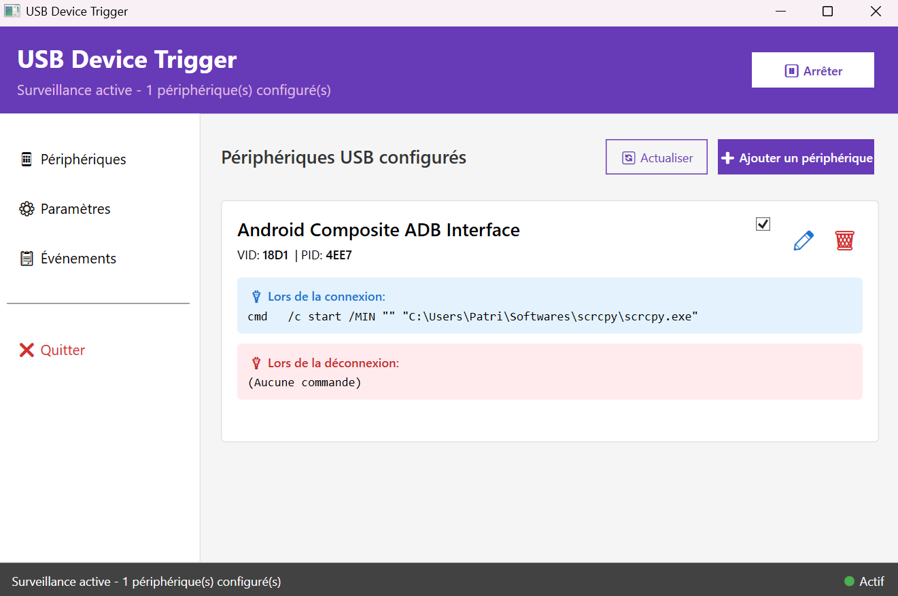
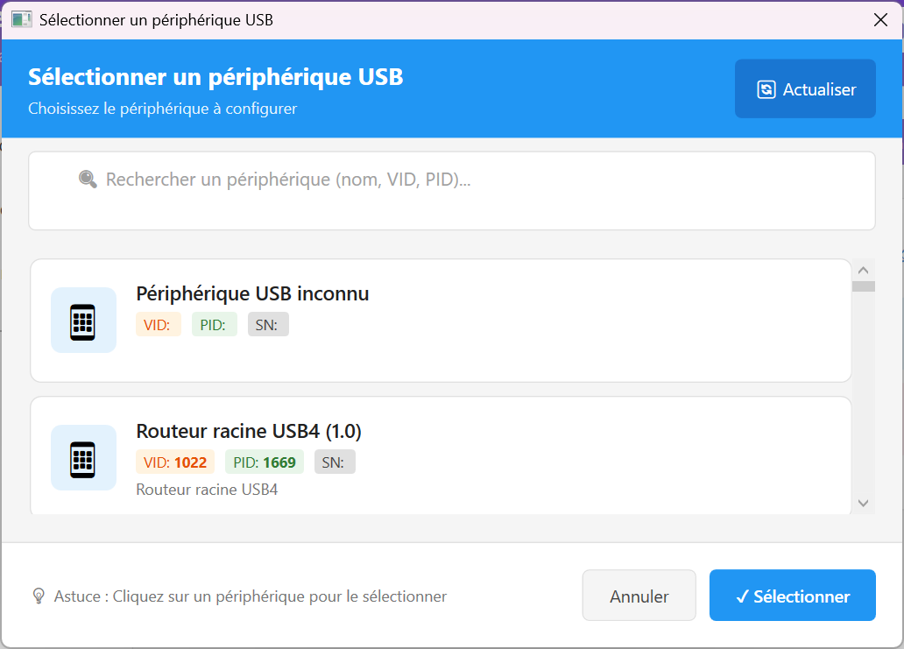
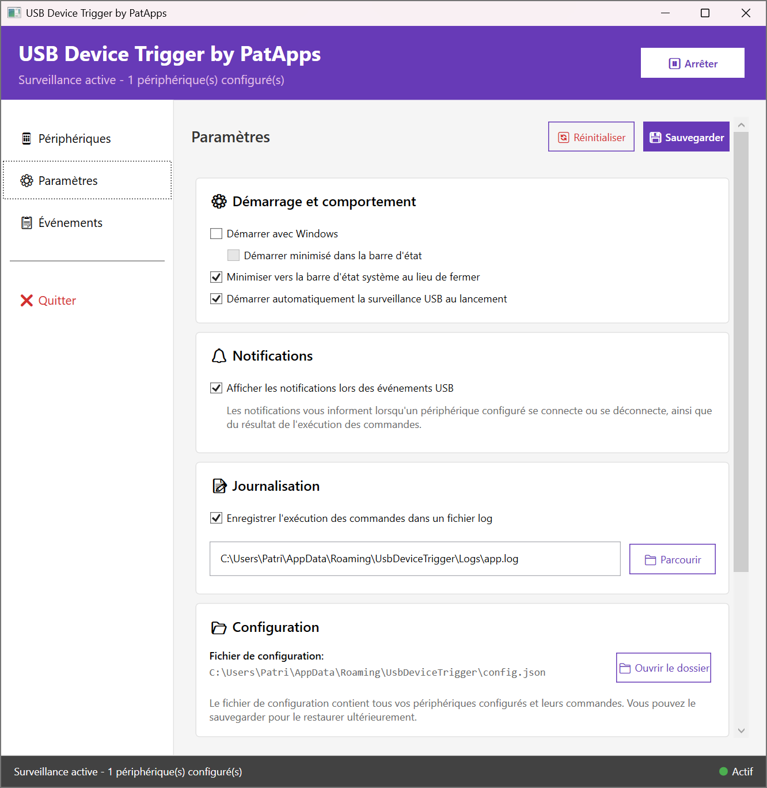
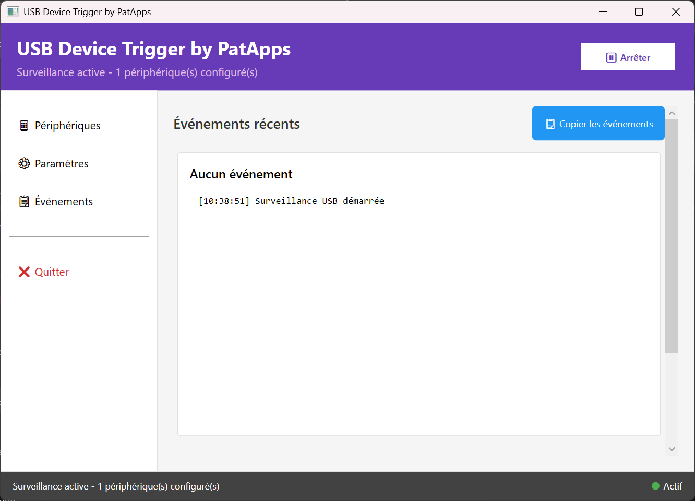

# USB Device Trigger by PatApps

Application Windows permettant d'exécuter automatiquement des commandes lors de la connexion ou déconnexion de périphériques USB.

## Fonctionnalités

- ✅ Détection automatique des événements USB (connexion/déconnexion)
- ✅ Configuration de commandes spécifiques par périphérique
- ✅ Interface utilisateur moderne (WPF + Material Design)
- ✅ Fonctionnement en arrière-plan (icône system tray)
- ✅ Démarrage automatique avec Windows
- ✅ Notifications des événements
- ✅ Journalisation des exécutions

## 📸 Aperçu

### Interface principale


### Configuration d'un périphérique


### Paramètres


### Journal des événements


## Prérequis

- **Système d'exploitation**: Windows 10 ou Windows 11 (64-bit)
- **Runtime**: .NET 8.0 Desktop Runtime

### Installation du .NET 8.0 Desktop Runtime

Si vous n'avez pas encore installé le .NET 8.0 Desktop Runtime, téléchargez-le depuis:
https://dotnet.microsoft.com/download/dotnet/8.0/runtime

Choisissez la version **Desktop Runtime** pour Windows x64.

## Installation

1. Téléchargez `UsbDeviceTriggerSetup-v1.0.0.exe`
2. Exécutez l'installateur
3. Suivez les instructions à l'écran
4. Choisissez les options d'installation:
   - Créer une icône sur le bureau
   - Démarrer avec Windows (recommandé)

## Utilisation

### Premier lancement

1. Lancez l'application depuis le menu Démarrer ou l'icône du bureau
2. L'application démarre et affiche la fenêtre principale

### Configuration d'un périphérique USB

1. Connectez le périphérique USB que vous souhaitez configurer
2. Allez dans l'onglet **Périphériques**
3. Cliquez sur **Ajouter un périphérique**
4. Sélectionnez le périphérique dans la liste des périphériques connectés
5. Configurez les commandes:

#### Exemple de commande à la connexion:
```
Commande: powershell
Arguments: -Command "Write-Host 'Ma clé USB est connectée!'"
```

#### Exemple de commande à la déconnexion:
```
Commande: cmd
Arguments: /c echo Périphérique déconnecté
```

### Exemples d'utilisation

#### Lancer une application
```
Commande: notepad.exe
```

#### Exécuter un script PowerShell
```
Commande: powershell
Arguments: -ExecutionPolicy Bypass -File "C:\Scripts\MonScript.ps1"
```

#### Copier des fichiers
```
Commande: robocopy
Arguments: "E:\Photos" "C:\Backup\Photos" /MIR
```

#### Monter un lecteur réseau
```
Commande: net
Arguments: use Z: \\serveur\partage /user:username password
```

### Fonctionnement en arrière-plan

- L'application fonctionne en arrière-plan via une icône dans la barre d'état système
- Double-cliquez sur l'icône pour ouvrir la fenêtre principale
- Clic droit sur l'icône pour accéder au menu contextuel

### Paramètres

Accédez aux paramètres pour configurer:
- ✓ Démarrage avec Windows
- ✓ Minimisation vers la barre d'état
- ✓ Notifications
- ✓ Journalisation des commandes

## Architecture du projet

```
UsbDeviceTrigger/
├── src/
│   ├── UsbDeviceTrigger.Core/       # Logique métier
│   │   ├── Models/                  # Modèles de données
│   │   └── Services/                # Services (USB, Config, Commandes)
│   │
│   └── UsbDeviceTrigger.UI/         # Interface utilisateur WPF
│       ├── ViewModels/              # MVVM ViewModels
│       ├── Views/                   # Vues XAML
│       └── Converters/              # Convertisseurs de binding
│
├── setup/                           # Script Inno Setup
└── README.md
```

## Compilation depuis les sources

### Prérequis de développement

- Visual Studio 2022 ou supérieur
- .NET 8.0 SDK
- Inno Setup (pour créer l'installateur)

### Étapes de compilation

1. Clonez le repository:
```bash
git clone https://github.com/patrick-oliveira-ch/UsbDeviceTrigger.git
cd UsbDeviceTrigger
```

2. Ouvrez la solution dans Visual Studio:
```
UsbDeviceTrigger.sln
```

3. Restaurez les packages NuGet:
```bash
dotnet restore
```

4. Compilez la solution en mode Release:
```bash
dotnet build --configuration Release
```

5. Créez l'installateur avec Inno Setup:
- Ouvrez `setup/UsbDeviceTrigger.iss` dans Inno Setup
- Cliquez sur **Build > Compile**

L'installateur sera créé dans le dossier `output/`.

## Technologies utilisées

- **Framework**: .NET 8.0 (WPF)
- **MVVM**: CommunityToolkit.Mvvm
- **UI**: MaterialDesignThemes
- **System Tray**: H.NotifyIcon.Wpf
- **USB Detection**: System.Management (WMI)
- **Configuration**: Newtonsoft.Json
- **Installateur**: Inno Setup

## Sécurité

- L'application fonctionne avec des privilèges utilisateur standard
- Les commandes en mode administrateur nécessitent une confirmation UAC
- Les configurations sont stockées en JSON dans `%APPDATA%\UsbDeviceTrigger\`

## Dépannage

### L'application ne détecte pas les périphériques USB

- Vérifiez que la surveillance est active (bouton "Démarrer")
- Vérifiez les permissions WMI (exécuter en tant qu'administrateur si nécessaire)

### Les commandes ne s'exécutent pas

- Vérifiez que la configuration du périphérique est activée
- Consultez les logs dans `%APPDATA%\UsbDeviceTrigger\Logs\`
- Testez la commande manuellement dans un terminal

### L'application ne démarre pas

- Vérifiez que .NET 8.0 Desktop Runtime est installé
- Consultez les journaux d'événements Windows

## Licence

Ce projet est sous licence MIT. Voir le fichier LICENSE pour plus de détails.

## Support

Pour signaler un bug ou demander une fonctionnalité:
- Ouvrez une issue sur GitHub
- Envoyez un email à support@example.com

## Changelog

### Version 1.0.0 (2026-01-04)
- ✨ Version initiale
- Détection USB via WMI
- Exécution de commandes configurables
- Interface WPF moderne
- Démarrage automatique avec Windows
- System tray integration
